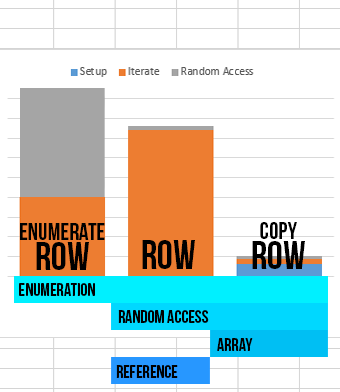

#ArrayMagic

**Do trivial things with arrays, that just aren't implemented in standard .NET.**

##Rectangular Arrays

Have you ever [wanted to take that rectangular array](http://stackoverflow.com/questions/9590144/c-sharp-rows-of-multi-dimensional-arrays),
and just do something with *one row* of it? That should be easy, right? Now it is.

    int[,] intmap = new int[10,10];
    //...
    int[] row = intmap.CopyRow(3);
    
This is all great, but that's just a copy. What if you want to change the data in the original array, on a per-row basis? (You can also read
the array with this.)

    var row = intmap.Row(3);
    row[4] = 1337;
    Console.WriteLine("Row 4 is " + intmap[3,4]); //prints "Row 4 is 1337"
    
*Note:* There is a caveat here. `.Row` returns a collection (an `IList`) and not an array. This may cause issues if your interfaces are very
picky with data types (and demand arrays). However, for most people, this should be fairly usable.

##Bit Arrays

For those long Saturday nights when you have to get to the *bit level* to make it work... Most things convert to `byte` arrays. Now `byte[]`
converts to bit arrays (`bool[]`). It's straight forward: `false` is `0` and `true` is `1`.

    var bytes = BitConverter.GetBytes(1337);
    bool[] bits = bytes.ToBitArray();
    
    //The first bit means "1" in binary. All odd numbers have this bit turned on.
    Console.WriteLine("The number is " + (bits[0] ? "odd" : "even")); //prints "The number is odd"

It's also useful if you just want to learn how to count in binary:

    //Print 0 to 4 in binary
    for (int i = 0; i < 5; i++)
    {
        Console.Write(i + ": ");
        
        //Bits are usually represented most- to least-significant; bit #0 is on the far right.
        var bits = BitConverter.GetBytes(i).ToBitArray().Reverse();
        
        foreach(var bit in bits)
        {
            Console.Write(bit ? "1" : "0");
        }
        Console.WriteLine();
    }
    
## Speed

